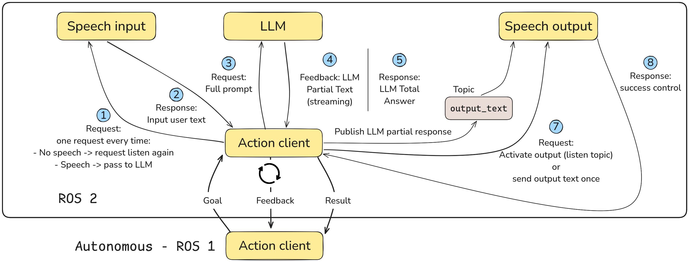

[](http://docs.ros.org/en/humble/index.html) &nbsp;
[](https://ubuntu.com/) &nbsp; [](https://github.com/Auromix/ROS-LLM/blob/ros2-humble/LICENSE) &nbsp;

# PARLAM
PARLAM (Personalized Assistant Retriever Language Model) is a framework implemented in ROS2 Humble Hawksbill designed to equip a robot with interaction capabilities akin to a chatbot. It enables natural language and audio conversations with humans. The prompts umust be saved at [data](parlam_pkg/data), if you want to see examples check branches of this repository.

This program is configured to work with an open-source Large Language Model. To tailor real-world scenarios, we have implemented two specific use cases: a package delivery (handover) and an information assistance task (info). For any interaction, the program is set by default to use [Vosk](https://alphacephei.com/vosk/models) speech to text models, [Piper](https://github.com/OHF-Voice/piper1-gpl) text to speech models and a Large Language Model of your choice accessed through Ollama. The models can be changed in the corresponding servers and by saving them and their configuration in the models folder.

## Architecture Diagram

This project uses a hybrid architecture that combines ROS 1 and ROS 2 modules to perform the experiments of PARLAM with [IVO robot](https://upcommons.upc.edu/bitstream/handle/2117/373443/2598-IVO-Robot%20-A-New-Social-Robot-for-Human-Robot-Collaboration(1).pdf?sequence=1). Only the ROS 2 modules are published in this repository but some remappings may be found across it, there is no need to use them if you don't do a mixed ROS 1 - ROS 2 architecture. 

The system can start either listening, processing text with the LLM or speaking a text, you have to adjust the [action conversation](parlam_interfaces/action/Conversation.action) goal values of "command" and "text" to manage that. In case the "text" is filled, the LLM will use it as input query or the output will speak that text, depending on the value of the command. In the same interfaces folder there are the interfaces needed for the basic functioning, any new interface may be created to suit your needs.

The system keeps listening until a verbal input is detected, by sending actions that run for the time specified in the parameter "listening_time" that can be configured in the launch file for the speech_input_server node. The "silence_timeout" parameter is the amount of seconds the model waits to validate an input as received, since there may be silence times between words of the same sentence. 

Language generation is done in real-time streaming, therefore the LLM returns sentences batches through feedback that the conversation_server manager publishes to the topic /output_text, to which the speech_output_server is subscribed. If you use this sentence streaming, the speech_output_server must have an active callback executing, with "use_text_field" as False and "text" empty.

However, if you want to stream output text without publishing on the topic, you can send an acion goal with the text to the speech_output_server as "text" parameter and "use_text_field" as True.
 
If you want the conversation to start with the robot explaining the instructions of the interaction, you can use the [instructions](parlam_pkg/data/instructions.txt) file to do that by using the function available in the conversation_server "send_instructions". 

The architecture is explained in the next graph using command 0, so that it starts listening, and it is the process that conversation_server follows.



## Relevant information

If you are considering cloning this repository, please note that you will need to do the following previous steps:

- [ ] **ollama model**: downloaded the LLM model you want to use locally. You can check your downloaeded models with "ollama list". To download a new one and run it on your terminal, do "ollama run {model_name}".

- [ ] **vosk model path**: You can download a model for each language in their [website](https://alphacephei.com/vosk/models). See the [setup file](parlam_pkg/setup.py) to check where the models have to be allocated. Note that the models are not uploaded in the repository due to their size.

- [ ] **piper model path**: The speech_output_server is set so that if the model is not already downloaded, use the information in a json file to download it. Example [english.json](parlam_pkg/models/piper/english.json), with the en_US-lessac-medium model. It uses the URL from where the model can be downloaded. The model can be changed by changing this file.

## To run the program:

1. Check audio input and output devices, and set them in the launch files:

- Input: pactl list sources | grep device.description
- Output: pactl list sinks | grep device.description 

2. Afterwards, install the [requirements](requirements.txt).

3. Source the setup script and launch the demo:
```bash
source <your_ws>/install/setup.bash
ros2 launch parlam_pkg_bringup parlam.launch.py
```
4. Either create a new node that acts as the action client of *llm_action* or run the command line to send a goal and start the interaction:

Example: ros2 action send_goal /llm_action_bridge/llm_action parlam_interfaces/action/Llm "{begin: 0, text: '', history: '[]'}" -f

## License
```
Copyright 2025 Lavinia Hriscu
Licensed under the Apache License, Version 2.0 (the "License");
you may not use this file except in compliance with the License.
You may obtain a copy of the License at
    http://www.apache.org/licenses/LICENSE-2.0
Unless required by applicable law or agreed to in writing, software
distributed under the License is distributed on an "AS IS" BASIS,
WITHOUT WARRANTIES OR CONDITIONS OF ANY KIND, either express or implied.
See the License for the specific language governing permissions and
limitations under the License. 
```

## Citation

If you use this repository in your research or work, please cite it as follows:

> Hriscu, L., Sanfeliu, A., & Garrell, A. (2025). Human Perception in Social Tasks: A Comparative Evaluation of Autonomous and Teleoperated Robots. IEEE Robotics and Automation Letters.
