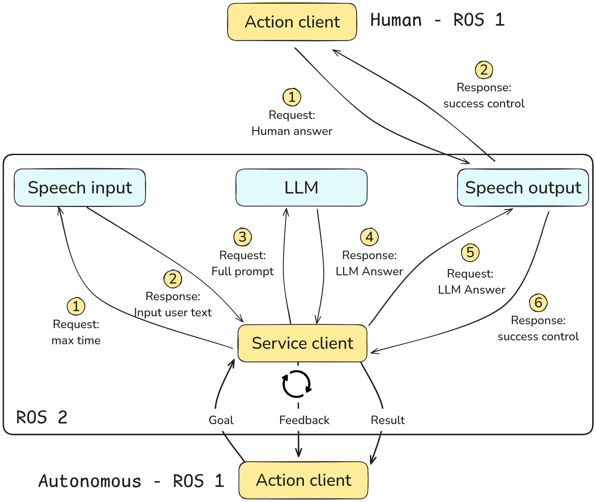

 [](http://docs.ros.org/en/humble/index.html) &nbsp;
[](https://ubuntu.com/) &nbsp; [](https://github.com/Auromix/ROS-LLM/blob/ros2-humble/LICENSE) &nbsp;

# PARLAM
PARLAM (Personalized Assistant Retriever Language Model) is a framework implemented in ROS2 Humble Hawksbill designed to equip a robot with interaction capabilities akin to a chatbot. It enables natural language and audio conversations with humans. The prompts used are available at [data](parlam_pkg/data).

This program is configured to work with a Large Language Model. To tailor real-world scenarios, we have implemented two specific use cases: a package delivery (handover) and an information assistance task (info). For any interaction, the program is set by default to use [Vosk](https://alphacephei.com/vosk/models) speech to text models, [gTTS](https://pypi.org/project/gTTS/) text to speech models and a Large Language Model (OpenAI ChatGPT). The models can be changed in the corresponding servers.

Using an agnostic embedding model (LaBSE), it can conduct conversations in multiple languages. The user has to select a preferred language to communicate with the robot. By default is set to English, but can be changed in the [launch file](parlam_pkg_bringup/launch/parlam.launch.py), as well as the audio sources, and the folder with the Vosk model.

## Architecture Diagram

This project uses a hybrid architecture that combines ROS 1 and ROS 2 modules to perform the experiments of PARLAM with [IVO robot](https://upcommons.upc.edu/bitstream/handle/2117/373443/2598-IVO-Robot%20-A-New-Social-Robot-for-Human-Robot-Collaboration(1).pdf?sequence=1). Only the ROS 2 modules are published in this repository. 

The system is designed to support both autonomous robotic capabilities and human teleoperation. In teleoperated scenarios, the robot leverages only the `speech_input_server` and `speech_output_server` nodes for verbal interaction, to use the same voice as in the autonomous case. To support this mode, we provide a dedicated launch file for the operator: [`parlam_operator.launch.py`](parlam_pkg_bringup/launch/parlam_operator.launch.py). For a brief guide of how to use such nodes, see the [operator guide](README_Operator.md).



## Information Retrieval

For the information assistance task, the system uses RAG (Retrieval Augmented Generation). The source information is stored in [Info](parlam_pkg/data/info_eng.pdf) and it is used with Chroma database for implementing a retrieval architecture.

## Relevant information

If you are considering cloning this repository, please note that you will need to do the following previous steps:

- [ ] **openaikey**: Add an environment variable with your OpenAI API Key. More information at: [OpenAI API](https://openai.com/index/openai-api/).

- [ ] **vosk model path**: You can download a model for each language in their [website](https://alphacephei.com/vosk/models). See the [setup file](parlam_pkg/setup.py) to check where the models have to be allocated. Note that the models are not uploaded in the repository due to their size.

## To run the program:

1. Check audio input and output devices, and set them in the launch files:

- Input: pactl list sources | grep device.description
- Output: pactl list sinks | grep device.description 

2. Afterwards, install the [requirements](requirements.txt).

3. Source the setup script and launch the demo:
```bash
source <your_ws>/install/setup.bash
ros2 launch parlam_pkg_bringup parlam.launch.py
```
4. Either create a new node that acts as the action client of *llm_action* or run the command line to send a goal and start the interaction:

Example: ros2 action send_goal /llm_action_bridge/llm_action parlam_interfaces/action/Llm "{begin: 0, text: '', history: '[]'}" -f

## Citation

If you use this repository in your research or work, please cite it as follows:

> Hriscu, L. PARLAM: Personalized Assistant Retriever Language Model. GitHub repository: [https://github.com/lhriscu/PARLAM](https://github.com/lhriscu/PARLAM).

## License
```
Copyright 2025 Lavinia Hriscu
Licensed under the Apache License, Version 2.0 (the "License");
you may not use this file except in compliance with the License.
You may obtain a copy of the License at
    http://www.apache.org/licenses/LICENSE-2.0
Unless required by applicable law or agreed to in writing, software
distributed under the License is distributed on an "AS IS" BASIS,
WITHOUT WARRANTIES OR CONDITIONS OF ANY KIND, either express or implied.
See the License for the specific language governing permissions and
limitations under the License. 
```